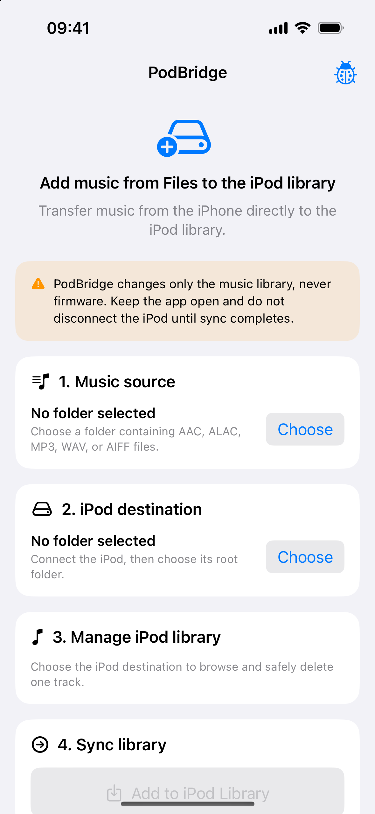

<h1 align="center">PodBridge</h1>

<p align="center">
  Copy music from Files on your iPhone straight to a click-wheel iPod.
</p>

For the code-level structure and ownership boundaries, see
[ARCHITECTURE.md](ARCHITECTURE.md).

<p align="center">
  
  
  
  
</p>

<p align="center">
  <a href="#getting-started">Getting started</a> ·
  <a href="#podbridgealacarte-self-hosted-build">ALACarte</a> ·
  <a href="#supported-ipods">Supported iPods</a> ·
  <a href="#safety-and-backups">Safety</a> ·
  <a href="PRIVACY.md">Privacy</a> ·
  <a href="#license">License</a> ·
  <a href="#building-the-project">Building</a>
</p>

<p align="center">
  
</p>

PodBridge lets you add music to a stock-firmware click-wheel iPod without going
back to a desktop sync app every time. Pick a folder on your iPhone, select the
iPod in Files, and PodBridge adds the tracks to its native music library.

The project is still experimental. Back up your iPod before using it and try a
single track before transferring a large folder.

## Highlights

- Transfers music directly from an iPhone to a supported iPod.
- Supports AAC, AIFF, M4A, M4B, MP3, and WAV files.
- Reads title, artist, album, duration, bitrate, and embedded artwork.
- Imports `.m3u` and `.m3u8` playlists while keeping their track order.
- Adds music to the native iPod menus and Cover Flow.
- Creates a database backup before each change and verifies the result before
  replacing the active library.
- Includes tools for browsing the iPod library and editing metadata or artwork.
- Shows the selected iPod model, song count, total capacity, used space, free
  space, and a storage bar.
- Can look up missing artwork through MusicBrainz and the Cover Art Archive.
- The optional `PodBridgeALACarte` target can browse and import from your own
  ALACarte server. No developer-operated server is configured or used.

## Supported iPods

Only one hardware combination has been tested so far. Every other profile is
experimental and is based on the database, checksum, and artwork formats
documented by libgpod. They still need real-world testing.

| Status | Model | Notes |
| --- | --- | --- |
| ✅ Tested | **iPod Classic 160 GB, Late 2009** (commonly called 7th generation), restored with macOS/Finder | Tested with an iPhone 15 Pro. |
| 🧪 Experimental | iPod Classic 160 GB, Late 2009, restored with Windows/iTunes (FAT32) | Uses the same Classic Hash58 database format and is expected to work, but has not yet been tested on physical hardware. Start with one track and keep a full backup. |
| 🧪 Experimental | iPod Classic 80 GB / 160 GB (2007) and iPod Classic 120 GB (2008) | Uses the Classic Hash58 database and Classic artwork formats. |
| 🧪 Experimental | iPod Video 5th / 5.5th generation | Uses an unsigned `iTunesDB` and 100 × 100 / 200 × 200 artwork caches. |
| 🧪 Experimental | iPod nano 1st / 2nd generation | Uses an unsigned `iTunesDB` and 42 × 42 / 100 × 100 artwork caches. |
| 🧪 Experimental | iPod nano 3rd generation | Uses Hash58 and the Classic-family artwork formats. |
| 🧪 Experimental | iPod nano 4th generation | Uses Hash58 and its own 50–240 px artwork-cache set. |
| ❌ Not supported | iPod nano 5th generation or newer, iPod touch, shuffle, mini, and iPod 1G–4G | These require SQLite libraries, Hash72/HashAB, or other database layouts that PodBridge does not write. |

After you select the iPod destination, PodBridge asks for the exact model and
uses the matching checksum and artwork profile. The app cannot verify that the
model you chose matches the hardware, so choose carefully.

Restore format also matters for the current test coverage. The known-good
configuration is the 160 GB Classic restored with macOS/Finder. A
Windows-restored FAT32 Classic uses the same on-iPod library format, and
PodBridge intentionally avoids Mac-only filesystem features, but that exact
configuration still needs a real-device test.

## Getting started

### What you need

- An iPhone running iOS 17 or later.
- A Mac with Xcode 26 or later to install the app.
- A supported iPod running Apple’s original firmware.
- A cable or adapter that lets the iPod appear in the iPhone Files picker.

### Install PodBridge on your iPhone

A free Apple ID is enough. A paid Apple Developer membership is not required.

1. Install [Xcode](https://apps.apple.com/app/xcode/id497799835) on your Mac
   and open it once.
2. On GitHub, choose **Code → Download ZIP**, then open the downloaded archive.
3. Open `PodBridge.xcodeproj` and choose a scheme:
   - **PodBridge** is the standard target intended for TestFlight/App Store.
     It contains no ALACarte client code or local-server permission.
   - **PodBridgeALACarte** is the Xcode/sideload target for connecting to your
     own ALACarte server.
4. Connect and unlock your iPhone. Tap **Trust** if either device asks.
5. In Xcode, select the PodBridge project and open **Signing & Capabilities**.
   Choose your Apple ID under **Team**. If it is not listed, add it in
   **Xcode → Settings → Accounts**.
6. Choose your iPhone in Xcode’s device menu and press the triangular **Run**
   button.
7. If iOS blocks the first launch, open **Settings → General → VPN & Device
   Management** and trust your developer profile.

Apps installed with a free Apple ID usually need to be installed again after
seven days. Reinstalling the iPhone app does not change anything on the iPod.

### Add your first track

1. Connect the iPod to the iPhone and check that it appears in Files.
2. Open PodBridge and choose a folder containing one music file.
3. Choose the root folder of the iPod as the destination.
4. Start the transfer and keep both devices connected until it finishes.
5. Eject the iPod, open Music on the iPod, and check that the track and artwork
   appear correctly.

Once that works, repeat the process with a larger folder.

## PodBridgeALACarte self-hosted build

`PodBridgeALACarte` is a separate target in the same Xcode project. It connects
to an ALACarte instance running on your own computer or home server, opens that
server's full web interface, and imports compatible files already present in
its library. It is intended for installation directly from Xcode or another
sideloading workflow, not for the TestFlight/App Store build.

The standard `PodBridge` target does not compile `ALACarteIntegration.swift`,
does not show ALACarte UI, and does not include the local-network usage
description. The two targets share the iPod database and transfer engine.

Use the [PodBridge-compatible ALACarte fork](https://github.com/dbalantaev/alacarte):

1. Install Docker and Docker Compose on an x86_64 computer or compatible host.
2. Clone the fork, copy `.env.example` to `.env`, and set `MUSIC_PATH` to your
   music-library folder.
3. Start it with `docker compose up -d --build`, open
   `http://<computer-address>:7373`, and complete ALACarte's initial setup.
4. In **ALACarte → Settings → Library output**, choose **ALAC**, not FLAC.
   Classic iPods and PodBridge do not support FLAC.
5. In Xcode, select the **PodBridgeALACarte** scheme and your iPhone, then press
   **Run**.
6. In PodBridgeALACarte, choose **Self-hosted library**, enter the address of
   your server and its username/password, then browse or import music.

For a server on the same Wi-Fi network, use its local HTTP address and port
`7373`. For remote access, use HTTPS through a private network. Do not expose
ALACarte's port directly to the public internet. The address and username are
saved locally, the password is not saved, and the resulting session is kept in
the iPhone Keychain. There are no bundled hostnames, IP addresses, credentials,
or remote-access presets.

The fork and its server-side changes are licensed separately under AGPL-3.0.
See its README for system requirements, security notes, and Apple Music terms.

## Safety and backups

Before changing the library, PodBridge saves the existing `iTunesDB` and, when
present, `ArtworkDB`. It builds the updated database separately, signs it,
checks that it can be read back, and only then replaces the active file.

Backups are stored on the iPod in:

```text
iPod_Control/iTunes/PodBridge Backups/<timestamp>/
```

If a transfer fails, PodBridge removes the files it just copied and rolls back
its artwork changes. It does not modify the iPod firmware, bootloader, or disk
partitions.

No software can protect a FAT filesystem from a cable being unplugged during a
write. Keep PodBridge open, do not disconnect either device while it is
working, and keep a separate full backup of the iPod.

## If PodBridge asks for a signature ID

An iPod Classic database is signed with an identifier unique to that device.
PodBridge reads it from `iPod_Control/Device/SysInfo` or `SysInfoExtended`.

Those files can be empty after an iPod restore, including a Windows/iTunes
restore. In that case, PodBridge will stop before changing the library and show
commands for retrieving the ID on macOS, Windows, or Linux. Enter it once and
PodBridge will reuse it for that iPod.

## Diagnostics

Tap the bug icon — or shake the iPhone — to open the diagnostics panel. The
report includes transfer stages, database sizes, filenames, playlist names,
backup operations, and errors. It does not include the iPod signature ID,
absolute source paths, cover-image bytes, or audio contents.

## Building the project

Open `PodBridge.xcodeproj` in Xcode 26 or later and select your development team under
**Signing & Capabilities**.

To build the standard test bundle from the command line:

```bash
xcodebuild \
  -project PodBridge.xcodeproj \
  -scheme PodBridge \
  -destination 'generic/platform=iOS Simulator' \
  CODE_SIGNING_ALLOWED=NO \
  build-for-testing
```

The tests cover database parsing and round-tripping, Hash58 signing, playlists,
Unicode metadata, artwork generation and rollback, diagnostic-log storage, and
ALACarte server compatibility and format validation.
Hardware testing is still required before using a large music library.

To build and test the self-hosted target:

```bash
xcodebuild test \
  -project PodBridge.xcodeproj \
  -scheme PodBridgeALACarte \
  -destination 'platform=iOS Simulator,name=iPhone 17 Pro' \
  CODE_SIGNING_ALLOWED=NO
```

## Contributing

Bug reports, fixes, and test results from other iPod Classic models are welcome.
For hardware reports, please include the iPod model, capacity, firmware version,
iOS version, and what happened with a one-track test. Remove any personal
information before attaching diagnostics.

## License

PodBridge's original source code is available under the [Mozilla Public
License, version 2.0](LICENSE).

The MPL's file-level copyleft means that modifications to covered source files
must remain available under the MPL. You may combine PodBridge with separately
licensed code in a larger work, provided that you continue to comply with the
MPL for the covered files.

Some portions of the project are derived from or document third-party work and
remain under their original terms. See [THIRD_PARTY_NOTICES.md](THIRD_PARTY_NOTICES.md)
before redistributing a build.

## Acknowledgements

PodBridge uses MusicBrainz and the Cover Art Archive for optional artwork
lookup. See [THIRD_PARTY_NOTICES.md](THIRD_PARTY_NOTICES.md) for details.
